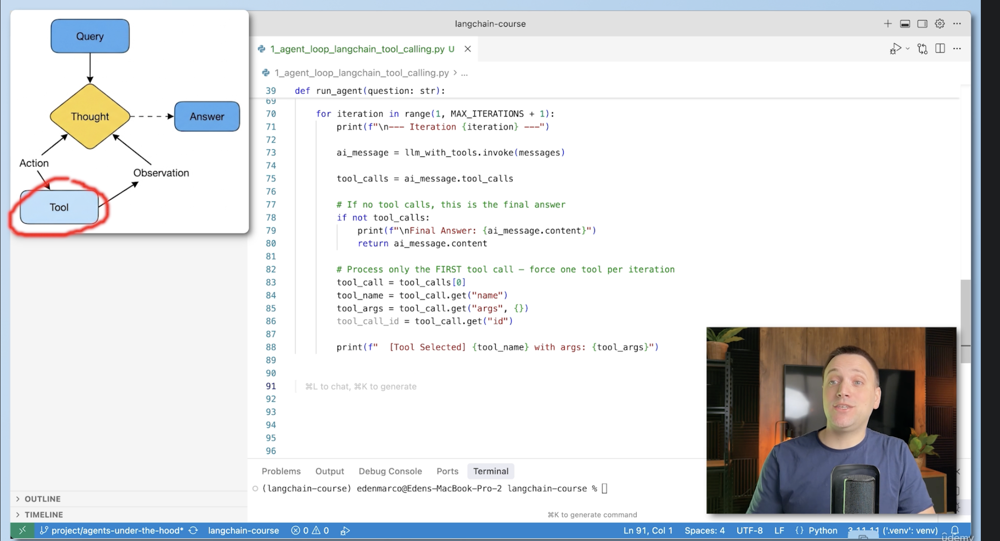

# Agents Under the Hood

This branch shows how an AI agent works internally, without relying on high-level abstractions.

## Architecture

This branch implements **Layer 1** of the architecture above:
- **Layer 0** — High-level: `create_agent()`, `TavilySearch` (LangChain abstractions)
- **Layer 1** — Mid-level: manual agent loop using `@tool`, `bind_tools()`, `init_chat_model()`, `ToolMessage` (LangChain primitives)
- **Layer 2** — Low-level: raw ReAct prompt, regex, scratchpad (no framework)

## ReAct Loop — Layer 1

The agent loop in `main.py` manually implements the ReAct (Reasoning + Acting) pattern:

1. LLM receives the question and decides which tool to call
2. The tool executes and returns a result
3. The result is added back to the message history
4. LLM is called again with the updated context
5. Repeat until the LLM returns a final answer (no more tool calls)

## What's covered

- How the **ReAct Loop (Layer 1)** works step by step
- How the LLM decides which tool to call
- How tool results are fed back into the LLM
- How the agent keeps looping until it reaches a final answer
