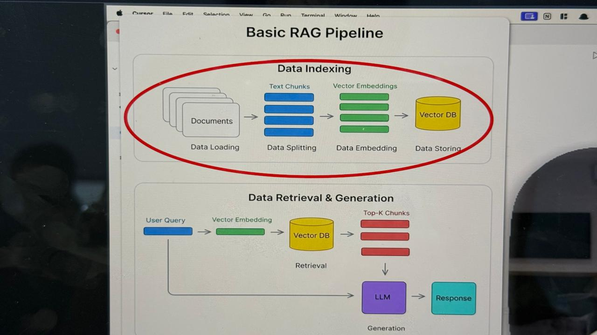
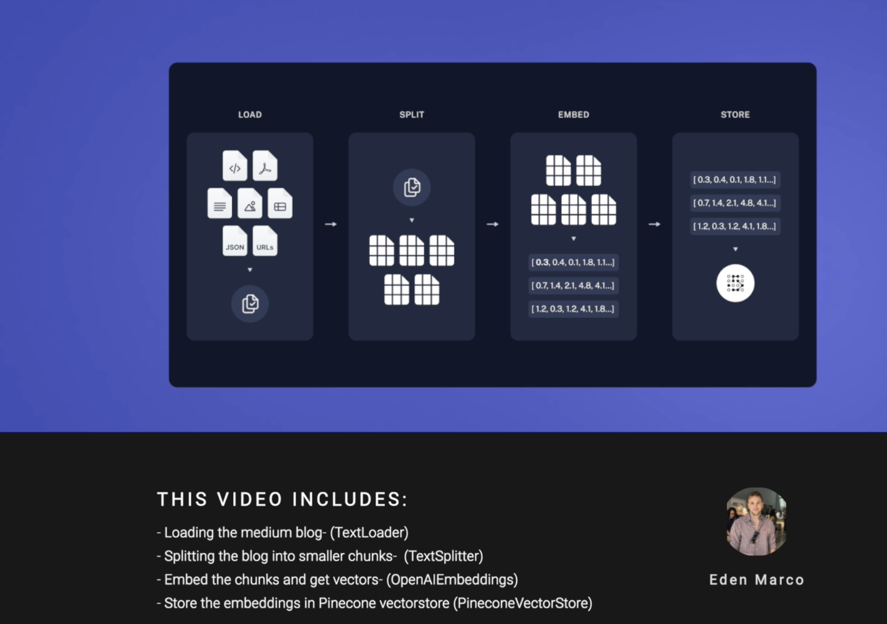
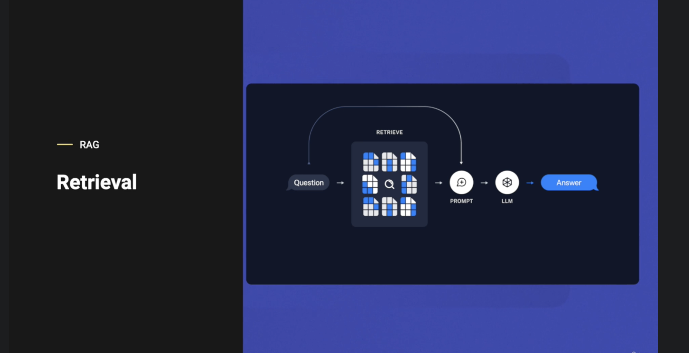

# LangChain Course — Branch Guide

## Branches

### 1. `project/hello-world`
The starting point. Sets up the project, installs dependencies, and runs a basic LangChain agent with a mock search tool. No real API calls — just enough to verify everything works and understand the basic structure of an agent.

### 2. `project/search-agent`
Builds a real search agent using `create_agent()` with Tavily for live web search. Introduces structured output via Pydantic models (`AgentResponse`, `Source`). This is **Layer 0** — LangChain and LangGraph handle the entire agent loop for you.

### 3. `projects/agents-under-the-hood`
Breaks open the black box. Shows how the agent loop works internally by implementing it manually, without relying on `create_react_agent()`. Covers Layer 1 in two ways — once with LangChain primitives, once with raw Ollama.

### 4. `projects/rag-gist` ← you are here
Builds a full RAG (Retrieval Augmented Generation) pipeline from scratch using LangChain and Pinecone. Covers data indexing, vector embeddings, and retrieval-based question answering.

---

# RAG Gist — `projects/rag-gist`

This branch builds a **RAG (Retrieval Augmented Generation)** pipeline from scratch using LangChain and Pinecone.

---

## Core Concepts

### Vector Embeddings
.jpeg)

Text cannot be stored or compared directly in a vector database. An **embedding model** converts text into a list of numbers (a vector) that captures the semantic meaning of the text. The example above shows a **1536-dimensional vector** — meaning each piece of text becomes a list of 1536 numbers. The more dimensions, the more information the vector can hold about the meaning of the text.

---

### Dense vs Sparse Vectors


There are two types of vectors used in search:

- **Dense Vectors** — every dimension has a value (few zeros). Compact, lower dimensionality, captures **semantic meaning**. Used in word embeddings and modern AI search (e.g. OpenAI embeddings).
- **Sparse Vectors** — mostly zeros, very high dimensionality. Captures **presence/absence** of words. Used in keyword-based search (e.g. TF-IDF, BM25, One-Hot encoding).

In RAG systems, dense vectors are used for semantic search — finding chunks that *mean* the same thing, not just contain the same words.

---

### RAG Pipeline


**RAG (Retrieval Augmented Generation)** gives the LLM access to your own documents at query time. It has two phases:

**Phase 1 — Data Indexing (done once):**
1. **Data Loading** — load your documents
2. **Data Splitting** — split into smaller text chunks
3. **Data Embedding** — convert each chunk into a vector
4. **Data Storing** — store vectors in a Vector DB (Pinecone)

**Phase 2 — Data Retrieval & Generation (done on every query):**
1. User sends a query → converted to a vector
2. Vector DB finds the most similar chunks (Top-K)
3. Those chunks + the query are sent to the LLM
4. LLM generates a response grounded in your documents

---

### Vector Similarity Metrics


When searching a Vector DB, similarity between vectors is measured using one of three metrics:

| Metric | Measures | Range | Best For |
|---|---|---|---|
| **Cosine Similarity** | Angle between vectors | [-1, 1] | Text search, recommendation systems |
| **Euclidean Distance** | Straight-line distance | [0, ∞) | Clustering, geometric data |
| **Dot Product** | Magnitude + direction | (-∞, ∞) | Neural networks, optimization |

**Key takeaway:** Cosine similarity is the most common for text/RAG — it focuses on the direction (meaning) of the vector, not its size, making it magnitude independent.

---

## Project Structure

```
projects/rag-gist/
├── ingestion.py       ← Phase 1: load, split, embed, store into Pinecone
├── pyproject.toml     ← dependencies
└── images/            ← concept diagrams
```

## Tech Stack

| Tool | Purpose |
|---|---|
| `langchain` | document loading, splitting, chaining |
| `langchain-openai` | OpenAI embeddings + LLM |
| `langchain-pinecone` | Pinecone vector store integration |
| `pinecone` | cloud vector database |
| `python-dotenv` | load API keys from `.env` |

## Files

### `ingestion.py` — Data Indexing (Phase 1)



Handles the one-time data indexing pipeline:
1. **Load** — load documents using `TextLoader`
2. **Split** — split into smaller chunks using `TextSplitter`
3. **Embed** — convert chunks to vectors using `OpenAIEmbeddings`
4. **Store** — store vectors in Pinecone using `PineconeVectorStore`

Run it once before querying:

```bash
uv run python ingestion.py
```

### `main.py` — Data Retrieval & Generation (Phase 2)



> **Naive RAG** is the foundational architecture of AI knowledge retrieval. It functions as a linear, three-step process: indexing data chunks, retrieving them based on a user's query, and passing those retrieved documents alongside the prompt to an LLM to generate a grounded, factual response.

Handles answering questions using the indexed data from Pinecone. Contains two implementations of the same RAG pipeline to show the difference:

**The flow:**
1. **Question** — user asks a question
2. **Retrieve** — question is embedded and matched against Pinecone (`k=3` top chunks)
3. **Prompt** — retrieved chunks are injected into a `ChatPromptTemplate` as `{context}`
4. **LLM** — the LLM generates an answer grounded in the retrieved documents
5. **Answer** — response returned to the user

**Option 0 — Raw LLM (No RAG):**
Calls the LLM directly without any retrieval. The LLM answers from its training data only — no grounding in your documents. Used as a baseline to compare against RAG.

**Option 1 — Manual RAG (without LCEL):**
Manually implements each step — retrieve → format → prompt → LLM → return. Verbose but easy to understand. Limitations: no streaming, no async, harder to compose.

```python
docs = retriever.invoke(query)          # retrieve top-3 chunks from Pinecone
context = format_docs(docs)             # join into one string
messages = prompt_template.format_messages(context=context, question=query)
response = llm.invoke(messages)         # LLM answers using context
```

**Option 2 — LCEL RAG (Better Approach):**
Same pipeline as Option 1 but written declaratively using the `|` pipe operator. Built-in streaming, async, and batching work out of the box.

```python
retrieval_chain = (
    RunnablePassthrough.assign(
        context=itemgetter("question") | retriever | format_docs
    )
    | prompt_template
    | llm
    | StrOutputParser()
)
```

Run it:

```bash
uv run python main.py
```

---

## LCEL — LangChain Expression Language

LCEL uses the `|` pipe operator to chain steps together — just like Unix pipes. Each step's output becomes the next step's input.

**How the chain works step by step:**

```
{"question": "what is Pinecone?"}
        ↓  RunnablePassthrough.assign(context=...)
{"question": "what is Pinecone?", "context": "chunk1\n\nchunk2..."}
        ↓  prompt_template
[SystemMessage, HumanMessage]  (filled with question + context)
        ↓  llm
AIMessage(content="Pinecone is a vector database...")
        ↓  StrOutputParser()
"Pinecone is a vector database..."   (plain string)
```

**`RunnablePassthrough.assign(context=...)`** — keeps the original dict AND adds a `context` key:
- `itemgetter("question")` → pulls the question string out of the dict
- `| retriever` → searches Pinecone, returns top-3 matching docs
- `| format_docs` → joins the docs into one string

The question is the **search key**, context is the **search result**.

**Why LCEL over manual:**

| | Manual (Option 1) | LCEL (Option 2) |
|---|---|---|
| Code style | Step by step | Declarative pipeline |
| Streaming | No | `chain.stream()` |
| Async | No | `chain.ainvoke()` |
| Batch | No | `chain.batch()` |
| Composable | Hard | Easy with `\|` |
| Production ready | No | Yes |

---

## Quiz — Key Concepts

**Q1: What is the primary purpose of `CharacterTextSplitter(chunk_size=1000, chunk_overlap=0)`?**
To break large documents into smaller, manageable pieces for embedding. LLMs and embedding models have token limits — you can't embed an entire document at once. Splitting into chunks of 1000 characters keeps each piece within limits and makes retrieval more precise.

**Q2: What role do `OpenAIEmbeddings` serve in RAG ingestion?**
They convert text chunks into high-dimensional vector representations (1536 dimensions). This is what allows semantic search — similar meaning → similar vectors → close together in vector space.

**Q3: What happens when you call `PineconeVectorStore.from_documents(docs, embeddings, index_name="rag-index")`?**
It creates embeddings for each document and stores both the vectors and the original text metadata in Pinecone. This is the final step of ingestion — after this, Pinecone can be queried.

**Q4: What is the purpose of `vectorstore.as_retriever()`?**
It converts the Pinecone vector store into a retriever interface for document search. The retriever is what the chain calls to find the most relevant chunks — it handles embedding the query and running the similarity search internally.

**Q5: What does `create_stuff_documents_chain(llm, retrieval_qa_chat_prompt)` accomplish?**
It creates a chain that combines retrieved documents with the LLM and prompt — "stuffing" all retrieved chunks into the prompt context so the LLM can answer based on them.

**Q6: What happens when you invoke the retrieval chain with `{"input": query}`?**
The query is embedded, similar documents are retrieved from Pinecone, and both the query and retrieved chunks are sent to the LLM together — the LLM then generates a grounded answer based on your documents.

---

## Environment Variables

Add these to your `.env` file:

```
OPENAI_API_KEY=...
PINECONE_API_KEY=...
```

---

## Knowledge — Using Tavily for Website Crawling

In this branch we used `TextLoader` to load a local `.txt` file. But in real projects your data often lives on websites.

**The problem with manual web scraping:**
- Raw HTML is full of noise — nav bars, footers, ads, scripts, CSS
- You have to write cleaning logic to strip all that out
- Different websites have different structures — your scraper breaks constantly
- JavaScript-rendered pages require headless browsers (Playwright, Selenium)

**Tavily solves this:**
Tavily crawls the URL for you and returns clean, structured text — no HTML parsing, no cleaning, no headless browser. Just pass the URL and get readable content back.

```python
from tavily import TavilyClient

client = TavilyClient()

# Instead of manually scraping + cleaning a webpage:
result = client.extract(urls=["https://example.com/article"])
clean_text = result["results"][0]["raw_content"]

# Now load it into LangChain as a document and ingest into Pinecone
```

**vs manual scraping:**

| | Manual Scraping | Tavily |
|---|---|---|
| HTML cleaning | You write it | Handled automatically |
| JS-rendered pages | Needs Playwright/Selenium | Handled automatically |
| Anti-bot protection | You handle it | Handled automatically |
| Output | Raw HTML | Clean readable text |
| Code needed | Lots | 3 lines |

Use Tavily when your RAG data source is a website — it replaces the entire scrape + clean pipeline with a single API call.

Add these to your `.env` file:

```
OPENAI_API_KEY=...
PINECONE_API_KEY=...
```
